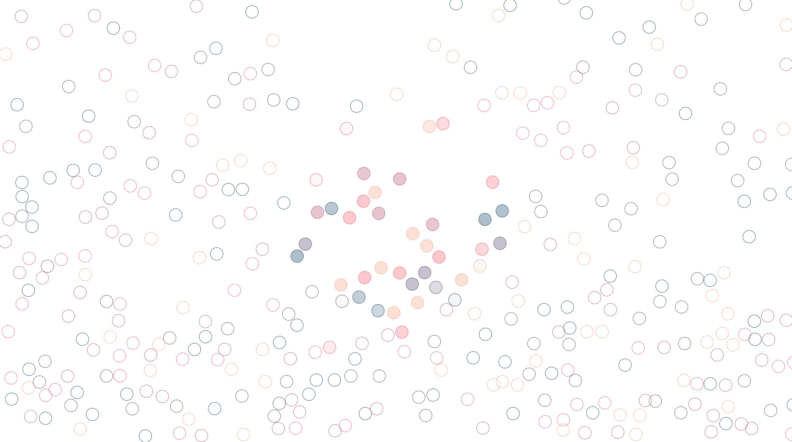

# particlesCollision
This fantastic application attempts to reflect the complexity of the physics behind the collision of particles in the field of gravity with friction. Press **spacebar** to add particles to the system.

Note: Keep the project file structure  

You can preview this project [here](https://fipie.github.io/particlesCollision/)

